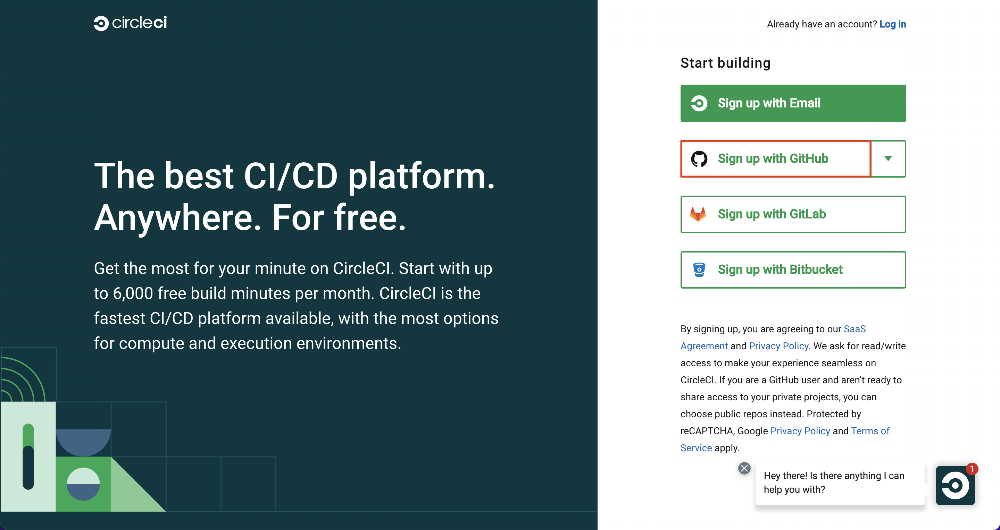
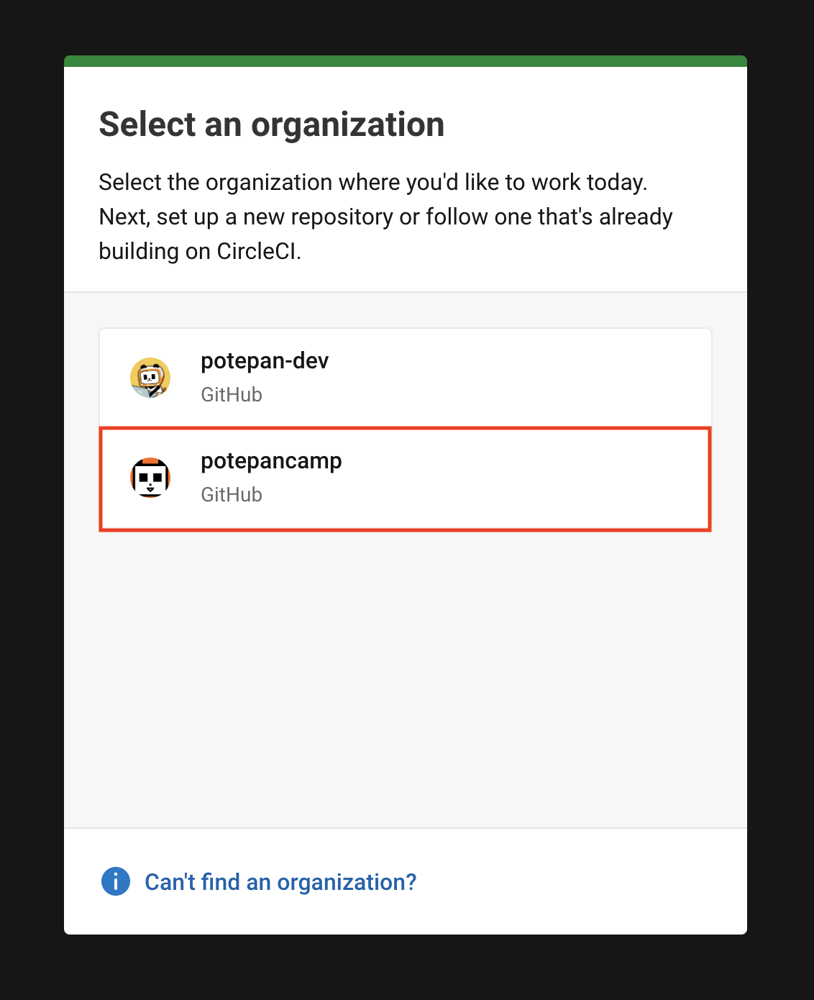
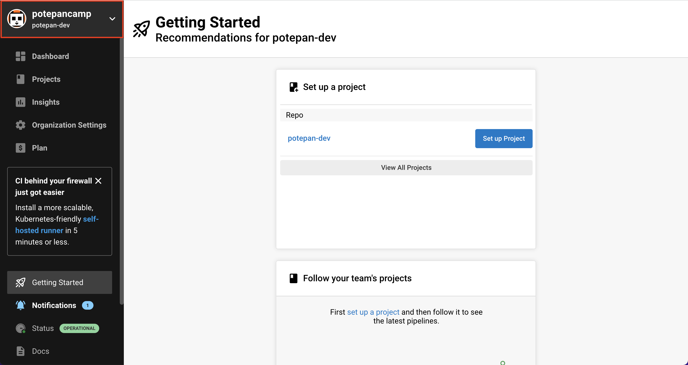
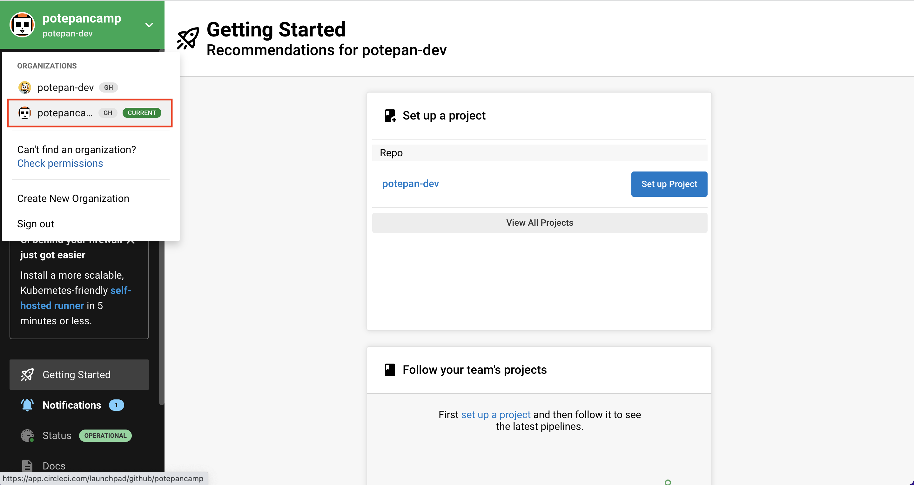
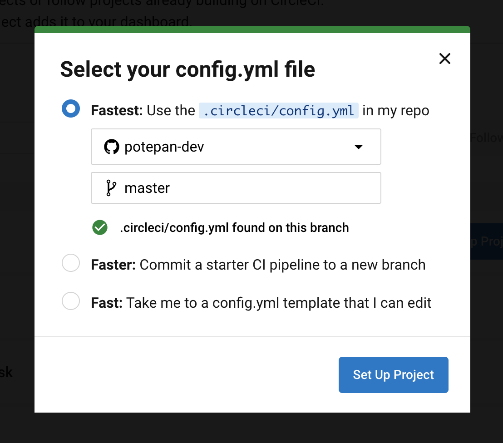
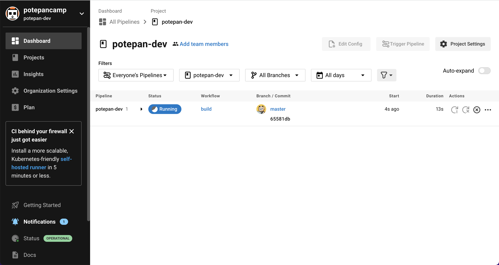
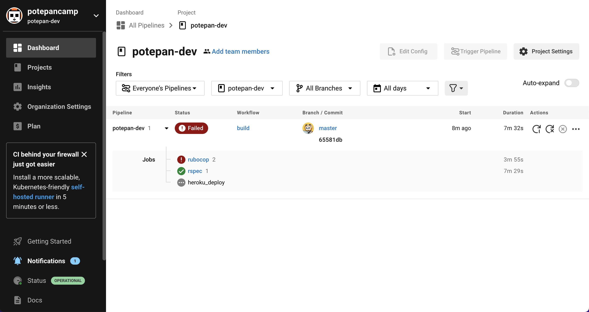
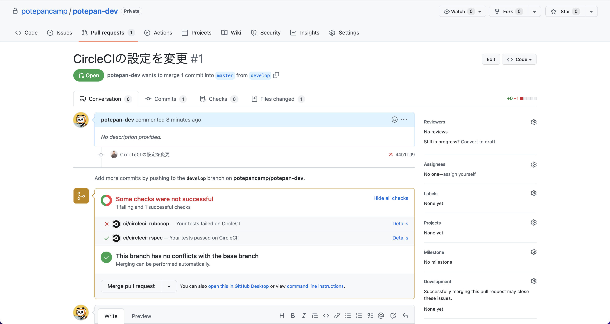
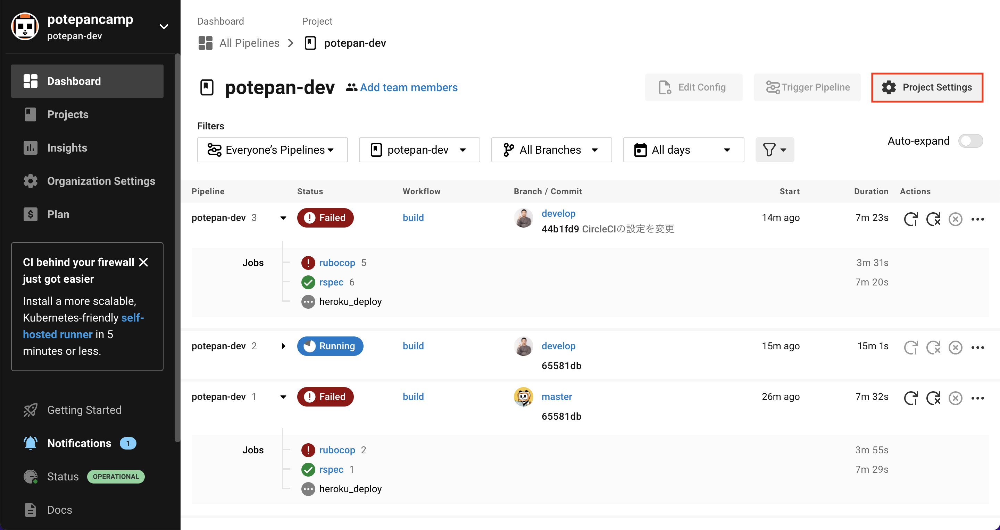

# CircleCIの設定

ここでは、CircleCI上でのRSpec・Rubocopの実行、及びHerokuへの自動デプロイの設定を進めていきます。 
CircleCIとの連携後、以下のようなフローで最終課題を提出することになりますので、まずはそのイメージだけでも掴んでおいてください。

1. ローカル環境での実装内容をcommitする
2. Github上のリモートリポジトリへpushする
3. PRを作成する（※PRを作成済みであれば、pushするだけでCIが動きます）
4. RSpec・RubocopがCircleCI上で実行される
5. RSpec・Rubocopともに問題なければ、最新のコードがHeroku上へデプロイされる

## GitHubと連携してみよう

まずは、GitHubとCircleCIを連携させていきましょう。

[サインアップページ](https://circleci.com/signup/)にアクセスし、`Sign up With Github`をクリックしてください。

`Select an organization`では、`potepancamp`を選択してください。

サインアップ後、画面左上のドロップダウンメニューをクリックしてください。

以下の画像の通り、ご自身のユーザー（ここでは`potepan-dev`）とポテパンキャンプの２つが表示されていれば、サインアップは完了です。

続いて、ご自身のリポジトリ（ここでは`potepan-dev`）をCIのビルド対象に追加するための設定を進めていきます。 
画面中央にご自身のリポジトリ（ここでは`potepan-dev`）が表示されていると思いますので、その横の`Set Up Project`をクリックしてください。

`config.yml`を追加するためのモーダルが表示されますが、`Fastest`のオプションで緑色のチェックマークが確認できれば、特に項目は変更せず、そのまま`Set Up Project`をクリックしてください。

設定が完了すると、以下のようにCircleCI上でCIが動き始めます。

しばらくすると、CIの実行結果が画面上で確認できるようになります。
（※この時点では設定が足りていないため、失敗していても問題ありません。）

また、Github上でPull Requestを作成することで、自動的にCircleCI上でCIが実行されるようにもなっています。

こちらでCircleCI上でRSpec・Rubocopを実行できるようになりましたので、続いて、CircleCIとHerokuの連携を進めていきましょう。

 

## Herokuと連携してみよう

### 事前準備

CircleCIからHerokuへ自動でデプロイする前に、まずはローカル環境からHeroku CLIを使って手動でデプロイできるようにしておく必要があります。 
手動デプロイの手順は、[ローカルからHerokuにデプロイする設定](../deploy/heroku.md)にてご説明していますので、まだご覧になっていない方はこちらを先に完了させておいてください。

### Herokuとの連携の流れ

ここではCirckeCIでテストが通った後、自動的にHerokuにデプロイするための設定を行います。

まずCircleCIにHerokuの認証情報を追加しましょう。

HerokuのWebページにログインし、右上の自分のアイコンから`Account settings`を選択してください。

`API Key`セクションにある`Reveal`ボタンをクリックすると表示されるトークンをコピーしておきます。

続いて、CircleCI上でPipelines画面の右上にある歯車アイコンをクリックしてください。

左メニューから`Environment Variable`を選択し、`Add Variables`ボタンをクリックするとポップアップが表示されます。

`Name`に`HEROKU_API_KEY`、`Value`に先ほどコピーしたHerokuのAPI Keyを入力し、`Add Variable`をクリックしてください。

次に、[ローカルからHerokuにデプロイする設定](../deploy/heroku.md)で取得したHerokuアプリ名とAWSの認証情報を追加していきます。

先ほどと同様にして、CircleCIの歯車アイコンから`Add Variables`を選択し、`HEROKU_APP_NAME`, `AWS_ACCESS_KEY_ID`, `AWS_SECRET_ACCESS_KEY`、という名前でそれぞれ環境変数を追加してください。

以上で設定は完了です!

これでCircleCIからHerokuにデプロイする準備が整いました。
